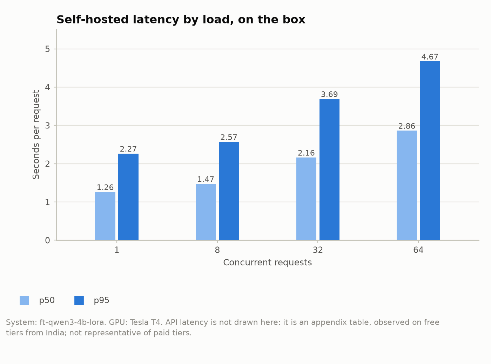

# finetune-vs-api

A LoRA fine-tune of a small open model, compared with API models, on one narrow task:
turning a free-text request into a single JSON function call.

```
"wake me up at nine am on friday"
  -> {"intent": "alarm_set", "slots": [{"type": "time", "value": "nine am"}, {"type": "date", "value": "friday"}]}
```

The intent is one of 60 and each slot type is one of 55; each slot value is text copied from
the request. The data is the English (en-US) part of MASSIVE 1.1 (11,514 train, 2,033 dev,
2,974 test requests).

**Status: results are in.** The adapter was trained on a free Kaggle T4 and its checkpoint picked
on dev; then each system was run once on the locked test subset, and the two self-hosted rows also
on the full test split. Everything under [Results](#results) is generated from `results/` by
`scripts/render.py`, and [docs/writeup.md](docs/writeup.md) is the draft write-up. Still to come:
a hand-labelled error analysis, and the adapter's release on Hugging Face.

## What is compared

| System | Model | Prompt | Where it runs |
|---|---|---|---|
| `ft-qwen3-4b-lora` | Qwen3-4B-Instruct-2507 + LoRA adapter | `finetuned_v1` | self-hosted: vLLM on one T4 |
| `base-qwen3-4b-k10` | Qwen3-4B-Instruct-2507 | `fewshot_k10_v1` | self-hosted: vLLM on one T4 |
| `groq-gpt-oss-20b-k10` | openai/gpt-oss-20b | `fewshot_k10_v1` | Groq, free tier |
| `groq-gpt-oss-120b-k10` | openai/gpt-oss-120b | `fewshot_k10_v1` | Groq, free tier |
| `groq-qwen3.8-27b-k10` | qwen/qwen3.8-27b | `fewshot_k10_v1` | Groq, free tier |
| `gemini-3.5-flash-lite-k10` | gemini-3.5-flash-lite | `fewshot_k10_v1` | Google AI Studio, free tier |

`fewshot_k10_v1` shows the model the 10 most similar training examples (embedding search with
`BAAI/bge-small-en-v1.5`, over the train split only). The fine-tune is trained on MASSIVE's
human-labelled train split; no API output is ever used as a label. Everything is defined in
`configs/` and `src/finetune_vs_api/prompts.py`.

## Results

<!-- results:start -->

### Exact match, paired against the fine-tune

Every system is compared with `ft-qwen3-4b-lora` on the items both have answered: the S500 subset (500 items), or the smaller subset a system ran on, as the Items column says. Intervals are 95% percentile bootstraps (10,000 resamples). The difference is the system minus the fine-tune, with a paired bootstrap interval and an exact McNemar test. A system "beats" another only when the interval of the difference excludes zero; otherwise the reading is "no significant difference". The full test split is a secondary column for the self-hosted rows.

| System | Items | Exact match | Difference from the fine-tune | McNemar p | Reading | Full test split |
|---|---|---:|---:|---:|---|---:|
| `ft-qwen3-4b-lora` | S500 (500) | 75.0% [71.2, 78.8] | reference | - | reference | 73.3% [71.7, 74.8] (n=2974) |
| `base-qwen3-4b-k10` | S500 (500) | 66.6% [62.4, 70.8] | -8.4 pp [-12.4, -4.6] | <0.001 | the fine-tune beats it | 66.1% [64.4, 67.8] (n=2974) |
| `groq-gpt-oss-20b-k10` | S500 (500) | 62.2% [57.8, 66.4] | -12.8 pp [-16.6, -9.0] | <0.001 | the fine-tune beats it | - |
| `groq-gpt-oss-120b-k10` | S500 (500) | 63.0% [58.8, 67.4] | -12.0 pp [-16.0, -8.2] | <0.001 | the fine-tune beats it | - |
| `groq-qwen3.8-27b-k10` | S500 (500) | 70.8% [66.8, 74.8] | -4.2 pp [-7.6, -0.6] | 0.024 | the fine-tune beats it | - |
| `gemini-3.5-flash-lite-k10` | S500 (500) | 67.8% [63.6, 71.8] | -7.2 pp [-10.8, -3.6] | <0.001 | the fine-tune beats it | - |

*All API rows ran on free tiers; no money was spent; costs are at paid list prices. Prices: <https://console.groq.com/docs/model/openai/gpt-oss-20b> (retrieved 2026-10-02), <https://console.groq.com/docs/model/openai/gpt-oss-120b> (retrieved 2026-10-01), <https://console.groq.com/docs/model/qwen/qwen3.8-27b> (retrieved 2026-10-02), <https://ai.google.dev/gemini-api/docs/pricing> (retrieved 2026-10-02). GPU rental: <https://instances.vantage.sh/aws/ec2/g4dn.xlarge> (retrieved 2026-10-01).*


### Cost and break-even

Costs are what the same calls would cost at the providers' paid list prices, as a pair of bounds: with the static prompt prefix cached, and with no caching. The self-hosted cost is a rented GPU kept busy; it has its own table below, at every measured load. Break-even is the monthly volume above which a GPU rented around the clock (730 hours a month, at the on-demand price) costs less than the API. It does not depend on the load.

| System | Priced as | Cost per 1,000 calls (cached prefix to no caching) | Break-even calls per month (same order) |
|---|---|---:|---:|
| `groq-gpt-oss-20b-k10` | paid list price | $0.107 to $0.129 | 3,587,762 to 2,977,721 |
| `groq-gpt-oss-120b-k10` | paid list price | $0.217 to $0.260 | 1,772,278 to 1,477,221 |
| `groq-qwen3.8-27b-k10` | paid list price | $0.896 with or without caching | 428,517 |
| `gemini-3.5-flash-lite-k10` | paid list price | $0.200 to $0.356 | 1,916,313 to 1,078,098 |

*All API rows ran on free tiers; no money was spent; costs are at paid list prices. Prices: <https://console.groq.com/docs/model/openai/gpt-oss-20b> (retrieved 2026-10-02), <https://console.groq.com/docs/model/openai/gpt-oss-120b> (retrieved 2026-10-01), <https://console.groq.com/docs/model/qwen/qwen3.8-27b> (retrieved 2026-10-02), <https://ai.google.dev/gemini-api/docs/pricing> (retrieved 2026-10-02). GPU rental: <https://instances.vantage.sh/aws/ec2/g4dn.xlarge> (retrieved 2026-10-01).*

### Self-hosted cost and latency by load

The fine-tune was measured on the box, with no network in the path, at every load level fixed in advance. No level met the rule for an operating point (p95 latency at or under 1 s), so cost is reported at every measured level instead. Each cost is a GPU rented at that price and kept busy at that load, at the on-demand price and at the spot price. The calls one GPU serves a month are its throughput at that load over 730 hours; a break-even volume can be reached on one GPU only at the loads where that figure is at least as large.

| Concurrency | Requests/s | p50 | p95 | Cost per 1,000 calls, on-demand | Cost per 1,000 calls, spot | Calls one GPU serves a month | APIs whose break-even range one GPU can serve |
|---:|---:|---:|---:|---:|---:|---:|---|
| 1 | 0.79 | 1.26 s | 2.27 s | $0.185 | $0.0963 | 2,076,901 | `groq-gpt-oss-120b-k10`, `groq-qwen3.8-27b-k10`, `gemini-3.5-flash-lite-k10` |
| 8 | 5.39 | 1.47 s | 2.57 s | $0.0271 | $0.0141 | 14,152,669 | `groq-gpt-oss-20b-k10`, `groq-gpt-oss-120b-k10`, `groq-qwen3.8-27b-k10`, `gemini-3.5-flash-lite-k10` |
| 32 | 14.40 | 2.16 s | 3.69 s | $0.0101 | $0.0053 | 37,837,287 | `groq-gpt-oss-20b-k10`, `groq-gpt-oss-120b-k10`, `groq-qwen3.8-27b-k10`, `gemini-3.5-flash-lite-k10` |
| 64 | 21.61 | 2.86 s | 4.67 s | $0.0068 | $0.0035 | 56,800,731 | `groq-gpt-oss-20b-k10`, `groq-gpt-oss-120b-k10`, `groq-qwen3.8-27b-k10`, `gemini-3.5-flash-lite-k10` |

*All API rows ran on free tiers; no money was spent; costs are at paid list prices. Prices: <https://console.groq.com/docs/model/openai/gpt-oss-20b> (retrieved 2026-10-02), <https://console.groq.com/docs/model/openai/gpt-oss-120b> (retrieved 2026-10-01), <https://console.groq.com/docs/model/qwen/qwen3.8-27b> (retrieved 2026-10-02), <https://ai.google.dev/gemini-api/docs/pricing> (retrieved 2026-10-02). GPU rental: <https://instances.vantage.sh/aws/ec2/g4dn.xlarge> (retrieved 2026-10-01).*



<details>
<summary>Other metrics, exact match per scenario, and API latency</summary>

#### Other metrics

| System | Intent accuracy | Slot F1 | Schema-valid | Slot values not in the request | Exact match without items whose text is in train |
|---|---:|---:|---:|---:|---:|
| `ft-qwen3-4b-lora` | 91.0% | 84.0% | 99.6% | 0.2% | 74.9% (n=498) |
| `base-qwen3-4b-k10` | 87.2% | 76.8% | 99.4% | 0.4% | 66.5% (n=498) |
| `groq-gpt-oss-20b-k10` | 87.4% | 73.7% | 100.0% | 1.8% | 62.0% (n=498) |
| `groq-gpt-oss-120b-k10` | 87.4% | 73.4% | 99.8% | 0.6% | 62.9% (n=498) |
| `groq-qwen3.8-27b-k10` | 89.6% | 79.4% | 100.0% | 0.2% | 70.7% (n=498) |
| `gemini-3.5-flash-lite-k10` | 89.0% | 77.5% | 100.0% | 0.2% | 67.7% (n=498) |

*All API rows ran on free tiers; no money was spent; costs are at paid list prices. Prices: <https://console.groq.com/docs/model/openai/gpt-oss-20b> (retrieved 2026-10-02), <https://console.groq.com/docs/model/openai/gpt-oss-120b> (retrieved 2026-10-01), <https://console.groq.com/docs/model/qwen/qwen3.8-27b> (retrieved 2026-10-02), <https://ai.google.dev/gemini-api/docs/pricing> (retrieved 2026-10-02). GPU rental: <https://instances.vantage.sh/aws/ec2/g4dn.xlarge> (retrieved 2026-10-01).*

#### Exact match per scenario

Each cell is exact match, with the number of items in the scenario in brackets. Cells this small are noisy.

| Scenario | `ft-qwen3-4b-lora` | `base-qwen3-4b-k10` | `groq-gpt-oss-20b-k10` | `groq-gpt-oss-120b-k10` | `groq-qwen3.8-27b-k10` | `gemini-3.5-flash-lite-k10` |
|---|---:|---:|---:|---:|---:|---:|
| alarm | 94% (16) | 88% (16) | 94% (16) | 94% (16) | 94% (16) | 94% (16) |
| audio | 80% (10) | 80% (10) | 80% (10) | 80% (10) | 90% (10) | 90% (10) |
| calendar | 74% (68) | 62% (68) | 54% (68) | 56% (68) | 62% (68) | 56% (68) |
| cooking | 58% (12) | 67% (12) | 75% (12) | 42% (12) | 67% (12) | 58% (12) |
| datetime | 76% (17) | 65% (17) | 53% (17) | 41% (17) | 71% (17) | 88% (17) |
| email | 80% (45) | 67% (45) | 62% (45) | 69% (45) | 73% (45) | 76% (45) |
| general | 59% (32) | 34% (32) | 41% (32) | 28% (32) | 38% (32) | 28% (32) |
| iot | 86% (37) | 81% (37) | 78% (37) | 81% (37) | 86% (37) | 86% (37) |
| lists | 88% (24) | 88% (24) | 79% (24) | 92% (24) | 88% (24) | 92% (24) |
| music | 86% (14) | 79% (14) | 64% (14) | 79% (14) | 79% (14) | 71% (14) |
| news | 76% (21) | 67% (21) | 62% (21) | 57% (21) | 71% (21) | 71% (21) |
| play | 55% (65) | 54% (65) | 42% (65) | 46% (65) | 57% (65) | 46% (65) |
| qa | 90% (48) | 77% (48) | 79% (48) | 79% (48) | 85% (48) | 81% (48) |
| recommendation | 56% (16) | 50% (16) | 50% (16) | 44% (16) | 50% (16) | 50% (16) |
| social | 72% (18) | 67% (18) | 56% (18) | 72% (18) | 78% (18) | 78% (18) |
| takeaway | 50% (10) | 40% (10) | 40% (10) | 50% (10) | 60% (10) | 60% (10) |
| transport | 76% (21) | 71% (21) | 71% (21) | 67% (21) | 71% (21) | 62% (21) |
| weather | 92% (26) | 85% (26) | 77% (26) | 77% (26) | 88% (26) | 88% (26) |

*All API rows ran on free tiers; no money was spent; costs are at paid list prices. Prices: <https://console.groq.com/docs/model/openai/gpt-oss-20b> (retrieved 2026-10-02), <https://console.groq.com/docs/model/openai/gpt-oss-120b> (retrieved 2026-10-01), <https://console.groq.com/docs/model/qwen/qwen3.8-27b> (retrieved 2026-10-02), <https://ai.google.dev/gemini-api/docs/pricing> (retrieved 2026-10-02). GPU rental: <https://instances.vantage.sh/aws/ec2/g4dn.xlarge> (retrieved 2026-10-01).*

#### Appendix: API latency

Latency of the API systems, observed on free tiers from India; not representative of paid tiers.

| System | p50 | p95 | Calls |
|---|---:|---:|---:|
| `groq-gpt-oss-20b-k10` | 0.52 s | 1.08 s | 500 |
| `groq-gpt-oss-120b-k10` | 0.57 s | 1.12 s | 499 |
| `groq-qwen3.8-27b-k10` | 0.23 s | 0.43 s | 500 |
| `gemini-3.5-flash-lite-k10` | 1.05 s | 1.55 s | 500 |

*All API rows ran on free tiers; no money was spent; costs are at paid list prices. Prices: <https://console.groq.com/docs/model/openai/gpt-oss-20b> (retrieved 2026-10-02), <https://console.groq.com/docs/model/openai/gpt-oss-120b> (retrieved 2026-10-01), <https://console.groq.com/docs/model/qwen/qwen3.8-27b> (retrieved 2026-10-02), <https://ai.google.dev/gemini-api/docs/pricing> (retrieved 2026-10-02). GPU rental: <https://instances.vantage.sh/aws/ec2/g4dn.xlarge> (retrieved 2026-10-01).*

</details>

Definitions and caveats are in [docs/method.md](docs/method.md). Every number is in `results/comparison.json`.

<!-- results:end -->

## Method

- **Metrics.** Exact match (intent and the multiset of slots), intent accuracy, slot
  precision/recall/F1, the share of outputs that are valid under the schema, and the share of
  predicted slot values that do not appear in the request. Slot values are compared lowercased
  and whitespace-collapsed; nothing else is normalized. An output that is not schema-valid
  scores zero on every task metric, and the schema-valid rate is reported next to them.
  Intervals are 95% percentile bootstraps (10,000 resamples, fixed seed).
- **Fixed subsets.** API systems run on free tiers with daily request caps, so they cannot see
  the whole test split. Every system runs on a fixed, seeded, scenario-stratified subset:
  D50 inside D100 (dev), S300 inside S500 (test). They are listed, with hashes, in
  `results/subsets.json`.
- **Test lock.** `scripts/lock_test.py` freezes a system's configuration (prompt, schema,
  model, decoding, checkpoint, price entry, dataset) and its test subset, with a reason, in an
  append-only history. `scripts/run_eval.py --split test` refuses to start unless the lock
  matches, so the test split cannot be tuned against.
- **Cost.** The API systems are not billed. Costs are what the same calls would cost at the
  providers' paid list price (`free tier; priced at paid list price`), given as a pair of
  bounds: with no prompt caching, and with the static prompt prefix cached. The self-hosted row
  is priced as a rented T4 kept busy, at every load measured. Prices, limits and the dates and
  pages they were read from are in `configs/sources.yaml`.
- **Free-tier caps.** When a daily quota runs out the runner saves its progress and stops,
  saying when the quota resets; run the same command again with `--resume` and it carries on.
  Nothing already answered is sent twice.

## Reproduce

Needs `uv` and Python 3.11. The steps below use no GPU, API key or model weight (the
embedding model, about 65 MB, is only downloaded the first time a few-shot prompt is built).

```bash
uv venv --python 3.11
uv pip install -r requirements.txt
uv pip install -e . --no-deps

pytest -q
ruff check .

python scripts/prepare_data.py       # downloads the archive (about 40 MB), verifies its sha256,
                                     # writes data/processed/ and results/data_audit.json
python scripts/make_subsets.py       # D50 / D100 / S300 / S500 -> results/subsets.json
python scripts/lock_test.py --show   # what each system still needs before it can be locked
python scripts/validate_chat_jsonl.py data/processed/sft_train.jsonl
python kaggle/train_on_kaggle.py --check data/processed   # validates the training files; no GPU
```

To bring your own OpenAI fine-tuning file, run `scripts/validate_chat_jsonl.py` on it first: it
accepts single-turn `{"messages": [system?, user, assistant]}` records and reports tools,
multimodal parts, weights and multi-turn records as unsupported in this version.

Running an evaluation needs an endpoint and its key:

```bash
cp .env.example .env                 # then fill in the keys you have
python scripts/check_free_tiers.py --dry-run
python scripts/run_eval.py --system groq-gpt-oss-20b-k10 --split dev --subset D50
```

Training and serving need a GPU. `kaggle/train_on_kaggle.py` trains the adapter, and
`kaggle/serve/serve_eval_on_kaggle.py` picks the checkpoint on dev, runs the locked test and
measures throughput; both ran as Kaggle notebooks on a free T4, and each folder holds its
notebook metadata. With the runs in `results/`, three commands rebuild every table, figure and
generated document:

```bash
python scripts/compare.py && python scripts/make_figures.py
python scripts/render.py --target all
```

## Know your data

`results/data_audit.json` has the details. In short: MASSIVE repeats some requests, within train
and across splits (a few repeated train requests even carry different labels), and a handful of
intents and slot types never occur in dev or test. These are facts about the data, not results.
The audit reports them so a reader can judge how much they matter.

## Layout

```
configs/      data, training, prices and limits, systems
src/finetune_vs_api/   data, schema, metrics, cost, config and test lock, prompts,
                       retrieval, subsets, client, evaluate, lora_merge, hf_server
scripts/      prepare_data, make_subsets, lock_test, run_eval, check_free_tiers, validate_chat_jsonl,
              bench_throughput, compare, make_figures, render
kaggle/       the training script and its notebook metadata; serve/ holds the serving,
              dev-selection, locked-test and throughput script and its metadata (both run on a T4)
templates/    the README results block, the model card and the write-up, filled in from results/
docs/         method.md (how everything is measured) and writeup.md (generated draft)
hf/           the model card for the adapter (generated)
results/      the audit, subsets, lock history, free-tier checks, runs, comparison, figures
tests/
```

## Licence and attribution

Code: MIT (`LICENSE`). The data is derived from MASSIVE and SLURP (CC BY 4.0), and the base
model is Qwen3-4B-Instruct-2507 (Apache 2.0): see `NOTICE.md` for the citations, what was
changed, and what will accompany the adapter when it is released.
