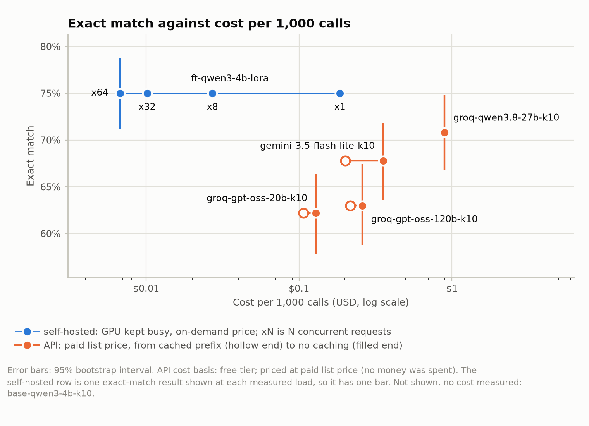

# A small fine-tune against API models, on one narrow task

## The question

Can a LoRA fine-tune of a small open model match API models on a narrow, well-specified task, and what does each cost to run? The task is to turn a request into one JSON function call: an intent (one of 60) and slots (each one of 55 types, its value copied from the request). The data is the English part of MASSIVE 1.1: 11,514 train, 2,033 dev and 2,974 test requests.

## The setup

The comparison has 6 systems:

- `ft-qwen3-4b-lora`: Qwen/Qwen3-4B-Instruct-2507 plus the LoRA adapter, prompt `finetuned_v1` (one-line instruction), self-hosted.
- `base-qwen3-4b-k10`: Qwen/Qwen3-4B-Instruct-2507, prompt `fewshot_k10_v1` (10 retrieved examples), self-hosted.
- `groq-gpt-oss-20b-k10`: openai/gpt-oss-20b, prompt `fewshot_k10_v1` (10 retrieved examples), Groq, free tier.
- `groq-gpt-oss-120b-k10`: openai/gpt-oss-120b, prompt `fewshot_k10_v1` (10 retrieved examples), Groq, free tier.
- `groq-qwen3.8-27b-k10`: qwen/qwen3.8-27b, prompt `fewshot_k10_v1` (10 retrieved examples), Groq, free tier.
- `gemini-3.5-flash-lite-k10`: gemini-3.5-flash-lite, prompt `fewshot_k10_v1` (10 retrieved examples), Google AI Studio, free tier.

The fine-tune is a LoRA adapter (rank 16, alpha 32, 2 epochs) fitted to the human-labelled train split only; no API output is a label. The API systems run on free tiers with daily request caps, so every system is scored on a fixed, seeded test subset, stratified by scenario: S500 (500 items), S300 (300 items, inside S500). Each system's configuration must be locked, with a reason, before the runner will touch the test split.

## Results

| System | Exact match | Difference from the fine-tune | Reading |
|---|---:|---:|---|
| `ft-qwen3-4b-lora` | 75.0% [71.2, 78.8] | reference | reference |
| `base-qwen3-4b-k10` | 66.6% [62.4, 70.8] | -8.4 pp [-12.4, -4.6] | the fine-tune beats it |
| `groq-gpt-oss-20b-k10` | 62.2% [57.8, 66.4] | -12.8 pp [-16.6, -9.0] | the fine-tune beats it |
| `groq-gpt-oss-120b-k10` | 63.0% [58.8, 67.4] | -12.0 pp [-16.0, -8.2] | the fine-tune beats it |
| `groq-qwen3.8-27b-k10` | 70.8% [66.8, 74.8] | -4.2 pp [-7.6, -0.6] | the fine-tune beats it |
| `gemini-3.5-flash-lite-k10` | 67.8% [63.6, 71.8] | -7.2 pp [-10.8, -3.6] | the fine-tune beats it |

*All API rows ran on free tiers; no money was spent; costs are at paid list prices.*



A system beats another only where the interval of the paired difference excludes zero. On exact match, the fine-tune beats `base-qwen3-4b-k10`, `groq-gpt-oss-20b-k10`, `groq-gpt-oss-120b-k10`, `groq-qwen3.8-27b-k10` and `gemini-3.5-flash-lite-k10`. On the full test split the fine-tune scores 73.3% [71.7, 74.8] (2,974 items).

## Where the gap comes from

Exact match needs the intent and every slot right. The fine-tune's slot F1 is 84.0% against 73.4% to 79.4% for the other systems; its intent accuracy is 91.0% against 87.2% to 89.6%.

Without the 2 S500 items whose text also occurs in train, the fine-tune scores 74.9% [71.1, 78.7] on 498 items.

The fine-tune's weakest scenario on S500 is takeaway (50.0%, 10 items); cells this small are noisy.

### Error analysis

This is the slot for the hand-labelled error analysis: the errors go in `results/error_analysis.csv`, with a `category` column that is counted here, and the reading of them goes in `docs/error_analysis.md`, which is included here. Until it is written, the draft makes no claim about why the systems differ.

## Cost and break-even

| System | Cost per 1,000 calls (cached prefix to no caching) | Break-even calls per month (same order) |
|---|---:|---:|
| `groq-gpt-oss-20b-k10` | $0.107 to $0.129 | 3,587,762 to 2,977,721 |
| `groq-gpt-oss-120b-k10` | $0.217 to $0.260 | 1,772,278 to 1,477,221 |
| `groq-qwen3.8-27b-k10` | $0.896 with or without caching | 428,517 |
| `gemini-3.5-flash-lite-k10` | $0.200 to $0.356 | 1,916,313 to 1,078,098 |

*All API rows ran on free tiers; no money was spent; costs are at paid list prices.*

A 1x NVIDIA T4 instance rented around the clock for 730 hours at the on-demand price ($0.526 an hour) costs $383.98 a month. Break-even is the monthly volume above which the rental costs less. No level met the rule for an operating point (p95 latency at or under 1 s), so cost is reported at every measured level instead. Self-hosted cost assumes a GPU kept busy; an idle one costs proportionally more.

| Concurrency | p95 (s) | On-demand (spot) per 1,000 calls | Calls one GPU serves a month |
|---:|---:|---:|---:|
| 1 | 2.27 | $0.185 ($0.0963) | 2,076,901 |
| 8 | 2.57 | $0.0271 ($0.0141) | 14,152,669 |
| 32 | 3.69 | $0.0101 ($0.0053) | 37,837,287 |
| 64 | 4.67 | $0.0068 ($0.0035) | 56,800,731 |

*All API rows ran on free tiers; no money was spent; costs are at paid list prices.*

*Prices: <https://console.groq.com/docs/model/openai/gpt-oss-20b> (retrieved 2026-10-02), <https://console.groq.com/docs/model/openai/gpt-oss-120b> (retrieved 2026-10-01), <https://console.groq.com/docs/model/qwen/qwen3.8-27b> (retrieved 2026-10-02), <https://ai.google.dev/gemini-api/docs/pricing> (retrieved 2026-10-02). GPU rental: <https://instances.vantage.sh/aws/ec2/g4dn.xlarge> (retrieved 2026-10-01).*

## Why now

OpenAI's deprecations page (https://developers.openai.com/api/docs/deprecations, retrieved 2026-10-01) lists these dates for fine-tuned models, evals and new fine-tuning jobs:

- On 2026-10-23: Fine-tuned models shut down: ft-gpt-3.5-turbo, ft-gpt-4, ft-gpt-4.1-nano-2025-04-14, ft-babbage-002, ft-davinci-002 and ft-o4-mini-2025-04-16.
- From 2026-10-31: Evals become read-only.
- On 2026-11-30: Evals shut down.
- From 2027-01-06: Active existing customers can no longer create new fine-tuning jobs. Inference on existing fine-tuned models continues until their base model is deprecated.

An open-weights fine-tune that its owner serves does not depend on a provider's schedule.

## Limits

- The test subsets are samples: small differences are not resolved (the fine-tune's exact match is plus or minus 3.8 pp on S500 and 1.6 pp on the full split; paired differences carry up to plus or minus 3.9 pp).
- Each system runs once, at temperature 0, so run-to-run variance is not measured.
- Prices are list prices, which can change.
- Self-hosted cost assumes the throughput measured on Tesla T4 carries over to the rented 1x NVIDIA T4.
- MASSIVE has been public since 2022 and an MTEB mirror redistributes its test text, so any model may have seen it; 21 test items also occur in train.

## Reproduce

```bash
python scripts/prepare_data.py
python scripts/make_subsets.py
python scripts/lock_test.py --write --system NAME --reason "why now"
python scripts/run_eval.py --system NAME --split test
python scripts/bench_throughput.py --help
python scripts/compare.py && python scripts/make_figures.py
python scripts/render.py --target all
```

Definitions are in `docs/method.md`.

## Appendix: API latency

Latency of the API systems, observed on free tiers from India; not representative of paid tiers:

- `groq-gpt-oss-20b-k10`: p50 0.52 s, p95 1.08 s over 500 calls.
- `groq-gpt-oss-120b-k10`: p50 0.57 s, p95 1.12 s over 499 calls.
- `groq-qwen3.8-27b-k10`: p50 0.23 s, p95 0.43 s over 500 calls.
- `gemini-3.5-flash-lite-k10`: p50 1.05 s, p95 1.55 s over 500 calls.
